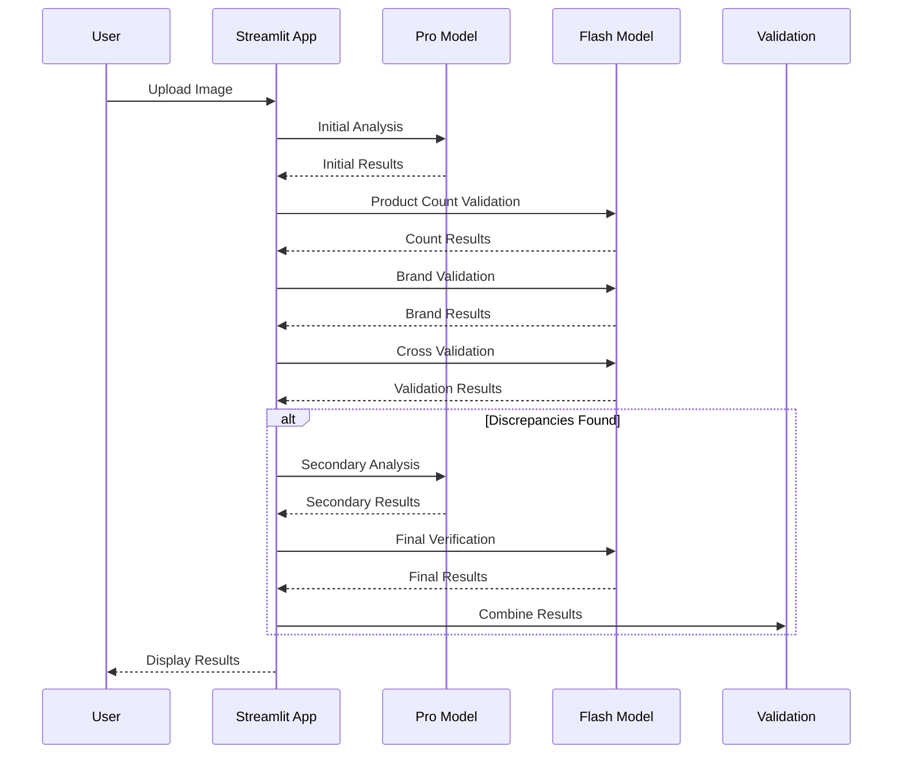
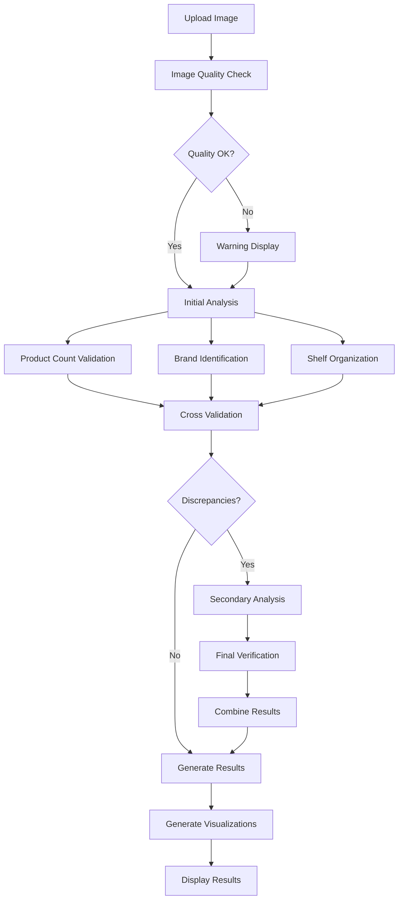

# Análise de Visual Shelf Share

# Visual Shelf Share Analysis

This project analyzes images of pharmacy shelves to determine the visual shelf share of different pharmaceutical manufacturers. It uses Google's Vertex AI Gemini model for image analysis and generates a detailed report with visualizations.

## Features

*   **Image Upload:** Users can upload images of pharmacy shelves for analysis.
*   **Manufacturer Identification:** Automatically identifies manufacturers present in the image.
*   **Product Counting:** Counts the number of products from each manufacturer visible in the front row of the shelf.
*   **Visual Shelf Share Calculation:** Calculates the percentage of shelf space occupied by each manufacturer.
*   **JSON Output:** Presents the analysis results in a structured JSON format.
*   **Data Visualization:** Generates interactive charts and graphs to visualize the data, including:
    *   Bar charts for visual shelf share and product counts.
    *   Pie chart for visual shelf share distribution.
    *   Treemap for product distribution by manufacturer.
    *   Scatter plot to show the relationship between product count and visual shelf share.
*   **Key Metrics:** Displays key metrics such as total products, total manufacturers, and average shelf share.
*   **Observations and Considerations:** Provides insights into the methodology used and the distribution of manufacturers on the shelf.

## Analysis Pipeline

### Sequence Diagram


### Flow Diagram


## Project Structure

```
shelf-analysis/
├── app.py              # Main application file
├── config.py           # Configuration settings
├── utils.py            # Utility functions
├── schema.py           # JSON schema definitions
├── prompt.md          # Analysis prompts
└── images/            # Example images directory
```

## Validation Pipeline

The analysis uses a multi-stage validation pipeline:

1. **Initial Analysis (Pro Model)**
   - Product detection and counting
   - Brand identification
   - Shelf share calculation

2. **Validation (Flash Model)**
   - Product count verification
   - Brand identification verification
   - Cross-validation of results

3. **Quality Checks**
   - Image quality assessment
   - Confidence score calculation
   - Discrepancy detection

4. **Final Verification**
   - Secondary analysis if needed
   - Results combination
   - Final validation

## Configuration

The system uses various confidence thresholds that can be adjusted:

```python
ValidationThresholds(
    min_brand_confidence=75.0,
    min_count_confidence=85.0,
    min_overall_confidence=80.0,
    max_count_discrepancy=0.15,
    max_share_discrepancy=0.1,
    min_image_clarity=60.0,
    min_shelf_visibility=75.0,
    min_logo_visibility=65.0
)
```

## Requirements

- Python 3.8+
- Google Cloud Platform account
- Vertex AI API enabled
- Required Python packages (see requirements.txt) 